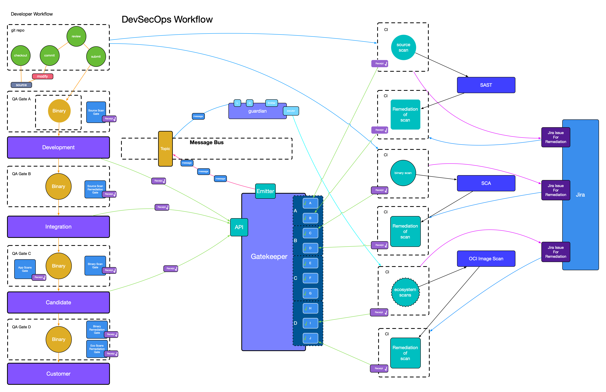

# Real-World Event-Driven CI/CD Implementation# Real World Examples

## Overview

What problem are we trying to solve? How can we solve it?

This case study examines a production implementation of event-driven CI/CD at an
Independent Software Vendor (ISV) delivering multi-architecture software
packages (RPMs, DEBs, OCI containers) to enterprise customers. The
transformation from a traditional Jenkins-based pipeline to a sophisticated
event-driven architecture demonstrates both the tremendous benefits and
practical challenges of implementing these systems at scale.

---

## The Legacy Challenge

The journey began in 2015 with a conventional software supply chain built around
Jenkins (CI) and Gerrit (SCM). Over several years, the team developed a
templated packaging system and custom asynchronous task engine for building and
packaging software across multiple architectures and formats.

### Pre-Event Architecture Limitations

- **Monolithic Dependencies**: Pipeline stages were tightly coupled to specific
  CI technology
- **Migration Complexity**: Upgrading CI systems required rebuilding the entire
  pipeline
- **Limited Scalability**: Sequential processing created bottlenecks in delivery
  velocity
- **Poor Observability**: Debugging pipeline failures required manual
  investigation across multiple systems

The catalyst for transformation came in 2019 when leadership demanded "full
CI/CD" capabilities. Rather than chaining thousands of Jenkins jobs together,
the team chose to implement a truly event-driven architecture that would be
CI-agnostic and extensible.

---

## Core Architectural Concepts

### Actions, Receipts, and Audit Trails

**Actions** represent discrete tasks within the delivery process: unit tests,
binary builds, functional tests, and integration tests. Each action produces a
**Receipt** that serves as an immutable audit record.

Receipts follow the CloudEvents specification structure with CNAB (Cloud Native
Application Bundle) payloads, containing:

- Complete action metadata and results
- Boolean "multipass" field indicating success/failure status
- Cryptographically verifiable audit trail
- NVRPP (Name, Version, Release, Platform ID, Package) identifier for unit
  tracking

### Gates and Stages Orchestration

**Gates** represent logical checkpoints that collect receipts for related
actions. For example, a "build gate" aggregates all receipts related to
compilation and packaging activities.

**Stages** define collections of gates that must all succeed before triggering
downstream activities. When all gates in a stage have successful receipts
(multipass: true), the stage emits an event to the Kafka topic, creating the
cascading effect that drives the pipeline.

### Unique Identification with ULIDs

The system uses ULIDs (Universally Unique Lexicographically Sortable
Identifiers) for all receipts, gates, and stages. ULIDs provide the benefits of
UUIDs while maintaining lexicographic sorting capabilities through embedded
timestamps, enabling efficient querying and debugging.

---

## Technology Stack and Tooling Decisions

### Event Infrastructure

- **Apache Kafka**: Chosen as the event message bus due to existing
  organizational infrastructure
- **JSON Messaging**: Selected over Avro for broader tooling compatibility and
  ease of integration
- **HTTP/REST Integration**: Legacy systems integrate via simple HTTP POST
  requests rather than requiring Kafka clients

### The Gatekeeper Service

The central communication hub built in Go with PostgreSQL storage provides:

- **CRUD Operations**: REST endpoints for receipts, gates, and stages management
- **GraphQL API**: Flexible querying capabilities for complex searches
- **Immutable Audit**: Receipts, gates, and stages can never be deleted, only
  revoked or disabled
- **Single Source of Truth**: Only the Gatekeeper service publishes to main
  Kafka topics

### Watcher Architecture

Specialized microservices (watchers) subscribe to Kafka topics and filter events
based on their domain expertise:

**Test Container Watcher**: Registers containerized test suites and manages
their lifecycle **Webhook Watcher**: Triggers external systems using Go
templates for URL formation and payload attachment **JIRA Integration Watcher**:
Automates ticket creation and tracks human approval workflows **Promotion
Watcher**: Advances software units through repository promotion stages

---

## Advanced Implementation Patterns

### Automated Testing Integration

The system integrates a comprehensive test automation framework through
event-driven orchestration:

1. **Test Container Registration**: Build events automatically register new test
   containers with their associated gates
2. **Parallel Execution**: Test containers run as Kubernetes jobs with injected
   configuration
3. **Result Processing**: xUnit output converts to receipts with pass/fail
   status
4. **Automatic Promotion**: Successful test stages trigger repository promotion
   without human intervention

### Incorporating Destructive Testing

For testing that cannot run alongside automated suites (database destructive
tests, performance testing), the system provides integration through external
gate validation:

- **External Gate Creation**: Destructive testing teams create their own gates
  outside the automated framework
- **Receipt Validation**: Special test containers query external gates during
  automated cycles
- **Consolidated Results**: External test results integrate seamlessly with
  automated pipeline decisions

### DevSecOps and Security Integration

Security scanning integrates through the same event-driven patterns:

- **Automated Scanning**: SAST, SCA, and OCI image scans trigger automatically
  and generate receipts
- **Policy Enforcement**: Failed scans create failing receipts that can gate
  downstream activities
- **Remediation Workflows**: JIRA integration tracks security issue resolution
  through ticket closure events
- **Future Gating**: Framework supports enabling security gates as pipeline
  blockers

---

## Lessons Learned from Production

### Observability is Critical

Event-driven asynchronous systems create significant debugging challenges. The
team found themselves constantly writing custom tools to understand system
behavior, leading to several key insights:

- **Tracing Tools**: Build comprehensive tracing capabilities from day one
- **Business Logic Discovery**: Create services that can decipher the business
  logic embedded in gate/stage relationships
- **UI Limitations**: GraphQL APIs are excellent for known queries but poor for
  exploratory debugging

### Schema Validation Prevents Issues

Rigorous JSON schema validation proved essential:

- **Gate Schemas**: Gates can specify JSON schemas for receipt custom sections
- **End-to-End Validation**: CloudEvents envelope, CNAB payload, and custom
  sections all validate
- **xUnit Schemas**: Test result parsing requires validated xUnit input to
  prevent data corruption

### Authentication and Security

Initial token-based authentication proved inadequate when developers committed
tokens to git repositories. OIDC implementation significantly improved security
posture and should be implemented from the beginning.

### Essential Guardrails

Several production incidents highlighted the need for built-in system
protections:

**Message Size Limits**: A fork-bomb scenario created 97MB receipts, leading to
1MB message limits with external storage for large data

**Rate Limiting**: A weekend service outage created thousands of queued events
that overwhelmed downstream services when replayed without rate limiting

**Input Sanitization**: Developers attempted to store binary data as base64 in
receipts, requiring strict input validation

### SDK and Developer Experience

The lack of a comprehensive Watcher SDK created ongoing maintenance challenges.
An SDK with standardized patterns would have:

- Simplified watcher development through common libraries
- Enabled centralized updates across all watchers
- Reduced the learning curve for new developers

---

## Performance and Business Impact

### Dramatic Velocity Improvements

The event-driven architecture delivered substantial performance gains:

- **Delivery Time**: Reduced from one week to 8 hours for getting new software
  versions to customers
- **Parallel Processing**: Multiple pipeline stages execute simultaneously
  rather than sequentially
- **Automated Quality**: Comprehensive testing automation increased confidence
  in software quality

### Organizational Transformation

Beyond technical metrics, the system enabled cultural changes:

- **Autonomous Teams**: Different teams can develop and deploy at their own
  cadences
- **Reduced Manual Labor**: Automation eliminated many manual approval and
  promotion steps
- **Enhanced Security**: Automated security scanning and remediation tracking
  improved overall security posture

---

## Architectural Evolution and Future Directions

### SLSA Provenance and Supply Chain Security

The foundation of cryptographically signed receipts positions the system well
for Software Supply Chain Levels for Software Artifacts (SLSA) compliance.
Future enhancements include:

- **Cryptographic Signatures**: Implementing receipt signing for tamper-proof
  audit trails
- **Provenance Generation**: Automatic generation of SLSA provenance documents
  from receipt chains
- **Attestation Framework**: Building verifiable attestations for security and
  compliance requirements

### Role-Based Access Control

Future development includes comprehensive RBAC implementation spanning:

- Event system permissions and access controls
- Integration with existing enterprise identity systems
- Pipeline-wide authorization rather than service-specific security

### Advanced Observability

Planned observability enhancements focus on:

- **Distributed Tracing**: OpenTelemetry integration for end-to-end request
  tracking
- **Business Metrics**: Higher-level dashboards showing business impact rather
  than technical metrics
- **Predictive Analytics**: Machine learning on event patterns to predict and
  prevent failures

---

## Integration with Modern Standards

### CDEvents Specification Alignment

The implementation predates but aligns well with the emerging CDEvents
specification. Future migration plans include:

- **Schema Migration**: Converting CNAB payloads to CDEvents-compliant
  structures
- **Standardized Vocabularies**: Adopting CDEvents semantic definitions for
  delivery activities
- **Ecosystem Integration**: Leveraging CDEvents for integration with
  third-party tools and platforms

### Cloud Native Ecosystem

The Kubernetes-native architecture enables integration with modern cloud-native
tools:

- **Service Mesh**: Istio integration for advanced networking and security
- **GitOps Workflows**: ArgoCD and Flux integration for infrastructure
  management
- **Observability Stack**: Prometheus, Grafana, and Jaeger integration for
  comprehensive monitoring

---

## Best Practices and Recommendations

### Design Principles

- **Immutable Events**: Treat all events as immutable facts rather than mutable
  state
- **Schema-First Development**: Define event schemas before implementation
- **Correlation Strategies**: Use consistent correlation IDs across service
  boundaries
- **Failure Handling**: Design for failure with retry mechanisms and dead letter
  queues

### Operational Excellence

- **Documentation Standards**: Maintain comprehensive READMEs and examples for
  every component
- **Testing Strategies**: Implement contract testing between event producers and
  consumers
- **Monitoring Practices**: Monitor event production, routing, and consumption
  health
- **Security Practices**: Implement comprehensive authentication and
  authorization from day one

### Organizational Considerations

- **Learning Curve Management**: Event-driven systems have high cognitive load;
  invest in training and onboarding
- **Guardrails Implementation**: Build system protections and limits from the
  beginning
- **Change Management**: Plan for gradual rollout rather than big-bang
  migrations

---

## Conclusion

This real-world implementation demonstrates that event-driven CI/CD
architectures can deliver transformational improvements in delivery velocity,
quality, and organizational agility. However, success requires careful attention
to observability, security, developer experience, and system guardrails.

The key insight is that event-driven architectures are not just technical
implementations—they represent fundamental changes in how organizations think
about software delivery, coordination, and quality assurance. Teams considering
similar transformations should prioritize the human and process aspects
alongside the technical implementation.

The system continues to evolve and serve as a foundation for new automation
initiatives, demonstrating the extensibility and long-term value of
well-designed event-driven architectures.

---

## Links

- [CDEvents Specification](https://cdevents.dev/)
- [CloudEvents Specification](https://cloudevents.io/)
- [CNAB Specification](https://cnab.io/)
- [CD Foundation](https://cd.foundation/)
- [SLSA Framework](https://slsa.dev/)
- [Enterprise Integration Patterns](https://www.enterpriseintegrationpatterns.com/)
