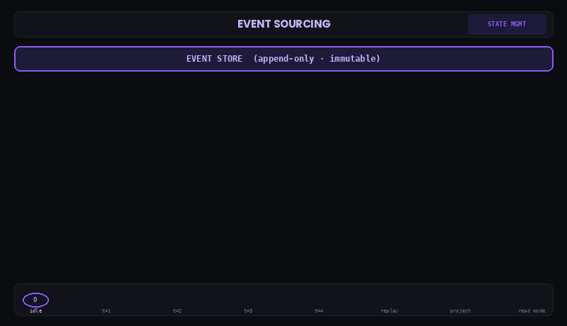
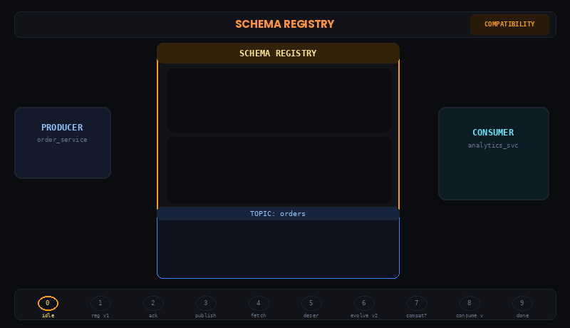
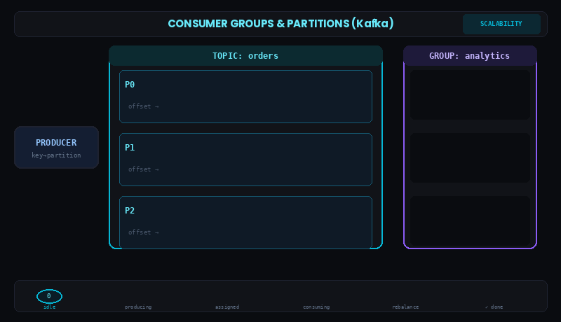
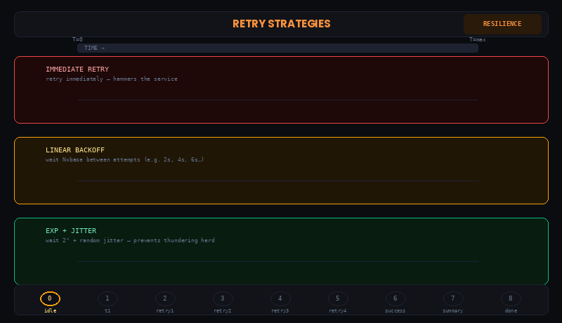
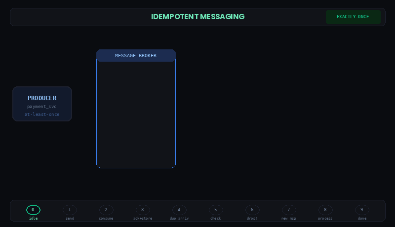
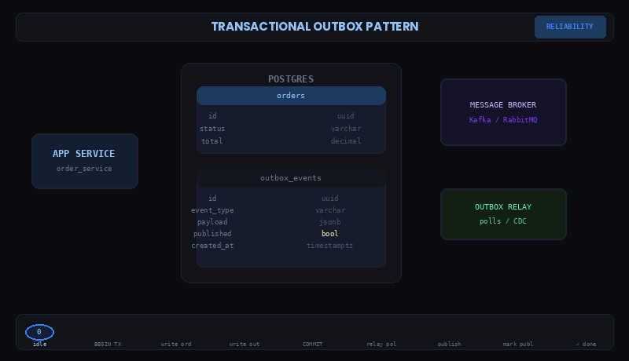
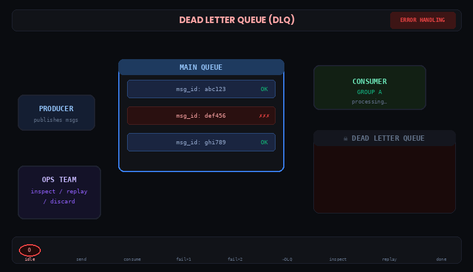
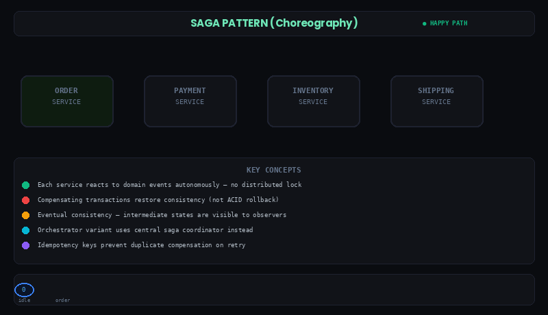
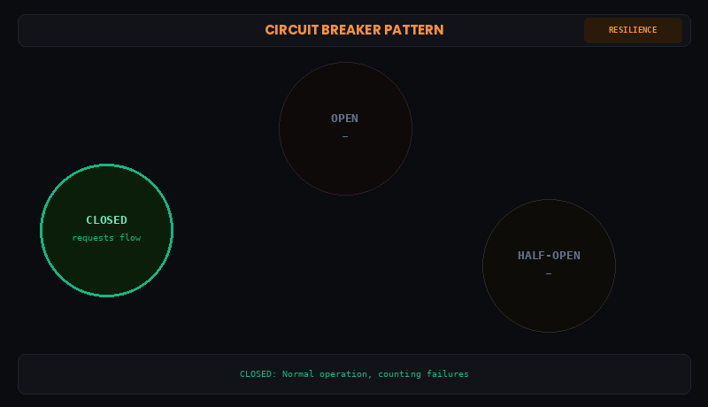
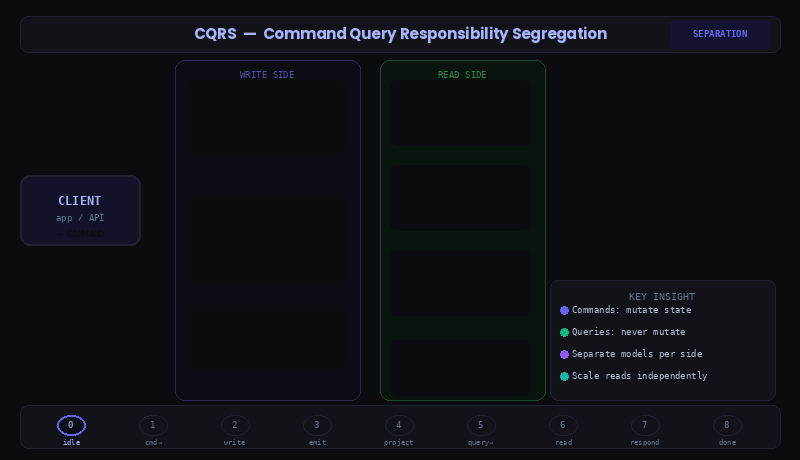

# Core Concepts

## Overview

In this section, we will cover the core concepts of event driven systems,
including: event sourcing, schema registry, consumer groups and partitions,
retry strategies, idempotent messaging, transactional outbox, dead letter
queues, saga, circuit breakers, and CQRS. We will also discuss the benefits and
challenges of using these concepts in your applications.

| #   | Pattern                      | Category       |
| --- | ---------------------------- | -------------- |
| 01  | Event Sourcing               | State Mgmt     |
| 02  | Schema Registry              | Compatibility  |
| 03  | Consumer Groups & Partitions | Scalability    |
| 04  | Retry Strategies             | Resilience     |
| 05  | Idempotent Messaging         | Exactly-Once   |
| 06  | Transactional Outbox         | Reliability    |
| 07  | Dead Letter Queue            | Error Handling |
| 08  | Saga (Choreography)          | Consistency    |
| 09  | Circuit Breaker              | Resilience     |
| 10  | CQRS                         | Separation     |

---

## Event Sourcing

Event sourcing is an architectural pattern where the state of a system is
derived entirely from an ordered, append-only log of events rather than from a
mutable record of current state. Instead of storing "service-a is at version
1.2.3 and was deployed successfully," you store the sequence of events that led
to that conclusion: build finished, tests passed, SBOM created, deployment
completed. The current state is always reconstructable by replaying the log,
which means you get a complete audit trail, point-in-time recovery, and the
ability to project the same event history into multiple read models for
different consumers.

---

## Schema Registry

A Schema Registry is a centralized service that stores, versions, and enforces
the schemas of messages flowing through your event pipeline. Producers register
their schema before publishing and consumers fetch it before processing,
ensuring both sides agree on message structure without requiring coordinated
deployments. The registry enforces compatibility rules — backward, forward, or
full — that prevent breaking schema changes from being registered at all,
turning what would otherwise be a runtime surprise into a build-time rejection.

---

## Consumer Groups and Partitions

Consumer Groups and Partitions are Kafka’s core mechanism for achieving
scalable, parallel message consumption without sacrificing ordering guarantees.
A topic is subdivided into partitions — ordered, append-only logs — and Kafka
guarantees message ordering only within a single partition, not across them. A
consumer group is a set of consumer instances that collectively subscribe to a
topic; Kafka’s group coordinator ensures each partition is assigned to exactly
one consumer within the group at any given time, so there is no duplicate
processing between members of the same group. This assignment is the key
insight: if you have three partitions and three consumers, each consumer owns
one partition and processes it independently in parallel — tripling throughput.
If you have more consumers than partitions, the excess consumers sit idle, which
is why partition count sets the hard ceiling on parallelism for a given topic.
Each consumer tracks its position in a partition via an offset — a simple
integer — and periodically commits that offset back to Kafka so that on restart
or rebalance it knows exactly where to resume. A rebalance is triggered whenever
the group membership changes — a consumer joins, crashes, or is removed — at
which point Kafka redistributes all partition assignments across the surviving
members, briefly pausing consumption during the handoff. Consumer lag, the gap
between the latest produced offset and the consumer’s committed offset, is the
primary operational health signal: a growing lag means your consumers cannot
keep up with the producer rate, and the remedy is either adding more partitions
(and consumers) or scaling the processing logic within each consumer instance.

---

## Retry Strategies

Retry strategies are the set of policies a consumer applies when message
processing fails, with the goal of recovering from transient failures without
losing messages or stalling the pipeline. The three core strategies — immediate
retry, exponential backoff with jitter, and the retry topic — suit different
failure classes: immediate retry is for sub-second infrastructure blips, backoff
is for overloaded downstream services that need time to recover, and the retry
topic is for failures that require minutes or hours to resolve and cannot block
a consumer thread. All three strategies share the same safety net: a Dead Letter
Queue that receives messages whose retry budget is exhausted.

---

## Idempotent Messaging

Idempotent messaging is the property that processing the same message more than
once produces the same result as processing it once. In a distributed system
with at-least-once delivery guarantees, duplicate messages are not exceptional —
they are expected, particularly during producer retries, consumer rebalances,
and replay scenarios. At the producer level, idempotence is achieved by enabling
the idempotent producer configuration, which assigns each message a producer ID
and sequence number that the broker uses to detect and discard duplicates within
a session. At the consumer level, idempotence requires explicit deduplication
logic, typically keyed on a stable natural identifier rather than a Kafka offset
or message UUID.

---

## Outbox Pattern

The Outbox Pattern is a solution to the dual-write problem: the fact that
writing to a database and publishing to a message bus are two separate I/O
operations that cannot be made atomic. The pattern solves this by writing both
the business record and an outbox entry in a single database transaction, then
using a separate relay process to read unpublished outbox rows and publish them
to the message bus, marking each row as published on success. Because the
database commit is the source of truth, a crash between the commit and the
publish is not a data loss event — the relay will publish the event on its next
run.

---

## Dead Letter Queues

A Dead Letter Queue (DLQ) is a dedicated topic where messages that cannot be
successfully processed are routed after exhausting their retry budget. Rather
than blocking the pipeline or silently dropping failed messages, a DLQ preserves
them for inspection and eventual reprocessing, giving operators visibility into
what went wrong and a recovery path once the underlying problem is fixed. Every
message routed to the DLQ should carry error metadata as headers — the original
topic, the exception type, the retry count, and a timestamp — so the cause of
failure is recorded alongside the payload itself.

---

## Saga

The Saga pattern is a strategy for managing distributed transactions across
multiple microservices without relying on a traditional two-phase commit (2PC)
or distributed lock. Instead of treating a multi-step operation as a single
atomic unit, a Saga breaks it into a sequence of local transactions, each scoped
to a single service and committed immediately. In the choreography variant — the
most common — each service publishes a domain event upon completing its step,
which the next service listens for and acts on autonomously; there is no central
coordinator. The critical corollary to this design is the compensating
transaction: because there is no global rollback, every forward step must have a
corresponding undo operation that can be triggered if a downstream step fails.
If inventory is out of stock after payment has already been charged, the Saga
emits a compensation event that instructs the payment service to issue a refund
and the order service to cancel — restoring consistency without ever having held
a distributed lock. This makes Sagas eventually consistent by nature:
intermediate states are real and observable, so consumers of that data must be
designed to tolerate them. The tradeoff is that Sagas are significantly harder
to reason about than atomic transactions — you must enumerate every failure mode
and its compensation upfront — but they are far more scalable and resilient in
systems where services are independently deployed and cannot share a database.

---

## Circuit Breakers

A circuit breaker is a component that wraps calls to an external dependency and
automatically stops making those calls when the dependency has failed enough
times to be considered unavailable. It operates in three states: closed (calls
pass through normally), open (calls are rejected immediately without hitting the
dependency), and half-open (one probe call is allowed through to test whether
the dependency has recovered). The pattern prevents a failing downstream service
from consuming all of a consumer's retry budget, thread pool, and processing
time — without it, a single broken dependency can freeze an entire pipeline
while every message burns through timeouts before landing in the DLQ.

---

## CQRS

Command Query Responsibility Segregation (CQRS) is a pattern that separates the
write path of a system from its read path, allowing each to be optimized
independently. In an event-driven context, commands produce events that are
written to a log, and queries are served from one or more read models that are
built by consuming and projecting those events. This separation is powerful
because different consumers can maintain different projections of the same event
stream — one optimized for low-latency lookups, another for aggregated
reporting, another for audit queries — without any of them competing with the
write path or with each other.

---

## Conclusion

These patterns do not operate in isolation. A production event-driven pipeline
typically combines all of them: schemas enforced by the registry, reliable
delivery guaranteed by the outbox pattern, failures handled by retry strategies
and circuit breakers, duplicates absorbed by idempotent consumers, state
reconstructable from the event log through event sourcing, and failed messages
preserved in the DLQ for investigation and replay. Understanding each pattern
individually is the prerequisite for understanding how they compose into a
system that is both resilient and auditable.

---
