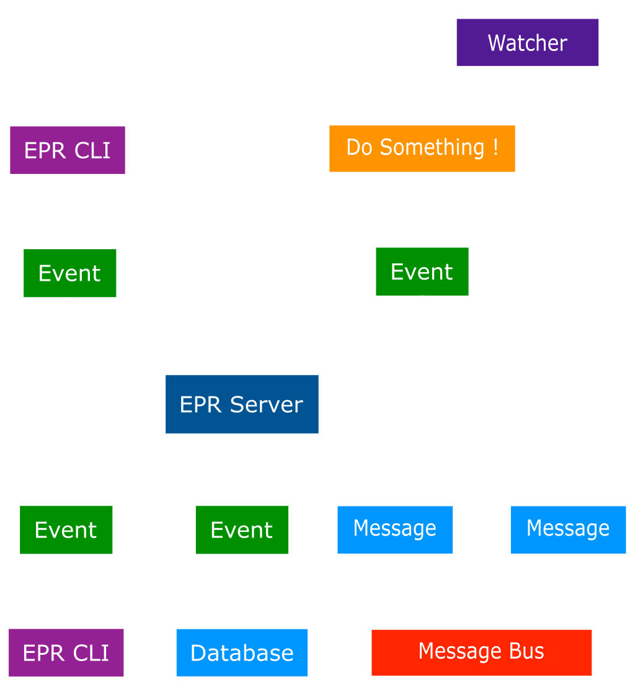

# EPR Workflow Diagram

Diagram to represent an Event Provenance Registry (EPR) workflow:

In this diagram:

- The "EPR Server" communicates with the "Database" for storing events.
- The "EPR CLI" creates events in the "EPR Server."
- The "EPR Watcher" watches for messages in "Redpanda". The "EPR Watcher" uses
  the message to do something. The "EPR Watcher" sends and event explaining the
  action to the "EPR Server."
- Both the "EPR Server" and "EPR Watcher" interact with "Redpanda" for sending
  and receiving messages.
