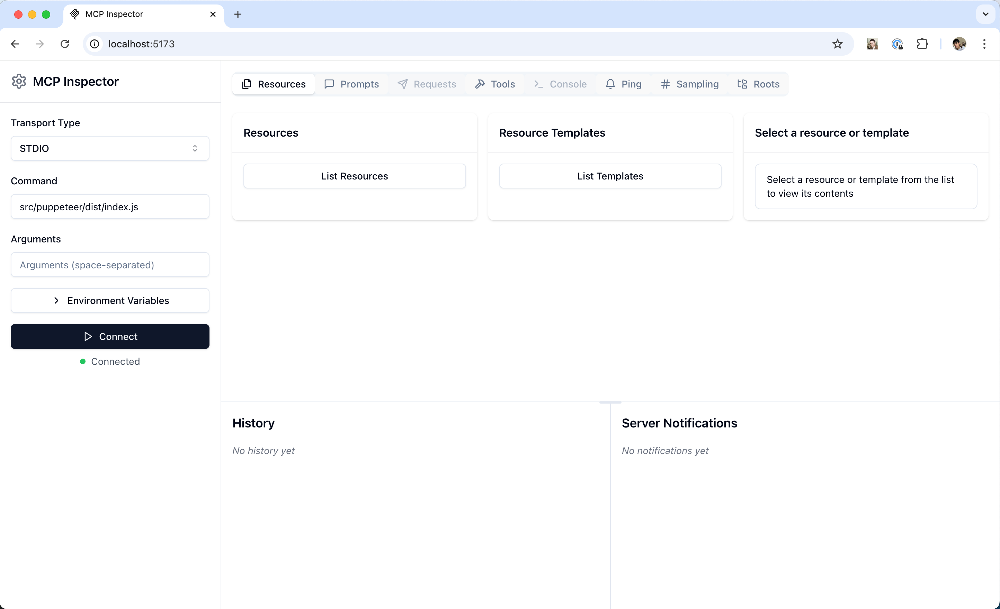

# MCP Inspector

# Inspector

Quickstart guide to using the MCP Inspector for testing and debugging Model
Context Protocol servers

The [MCP Inspector](https://github.com/modelcontextprotocol/inspector) is an
interactive developer tool for testing and debugging MCP servers.

---

## Getting started

### Installation and basic usage

The Inspector runs directly through `npx` without requiring installation:

```bash
npx @modelcontextprotocol/inspector
```

---

## Feature overview



The Inspector provides several features for interacting with your MCP server:

### Server connection pane

- Allows selecting the transport for connecting to the server
- For local servers, supports customizing the command-line arguments and
  environment

### Resources tab

- Lists all available resources
- Shows resource metadata (MIME types, descriptions)
- Allows resource content inspection
- Supports subscription testing

### Prompts tab

- Displays available prompt templates
- Shows prompt arguments and descriptions
- Enables prompt testing with custom arguments
- Previews generated messages

### Tools tab

- Lists available tools
- Shows tool schemas and descriptions
- Enables tool testing with custom inputs
- Displays tool execution results

### Notifications pane

- Presents all logs recorded from the server
- Shows notifications received from the server

---

## Best practices

### Development workflow

1. Start Development

   - Launch Inspector with your server
   - Verify basic connectivity
   - Check capability negotiation

2. Iterative testing

   - Make server changes
   - Rebuild the server
   - Reconnect the Inspector
   - Test affected features
   - Monitor messages

3. Test edge cases
   - Invalid inputs
   - Missing prompt arguments
   - Concurrent operations
   - Verify error handling and error responses

---

## Setup MCP Inspector

Setup the MCP Inspector to run the docker container with the MCP server

Transport Type: `STDIO`

Command: `docker`

Arguments: `run -i --rm --network=host epr-mcp-server:latest`

Environment Variable:

- EPR_URL
- http://localhost:8042

---

## Inspect MCP Server

Click on tools in the main window bar

Find `fetch_event` and click on it

Enter `epr_url` as `http://localhost:8042`

Then enter an event id

Click `Run Tool`

Results should look like this


---

## Links

- [MCP inspector](https://modelcontextprotocol.io/docs/tools/inspector)
