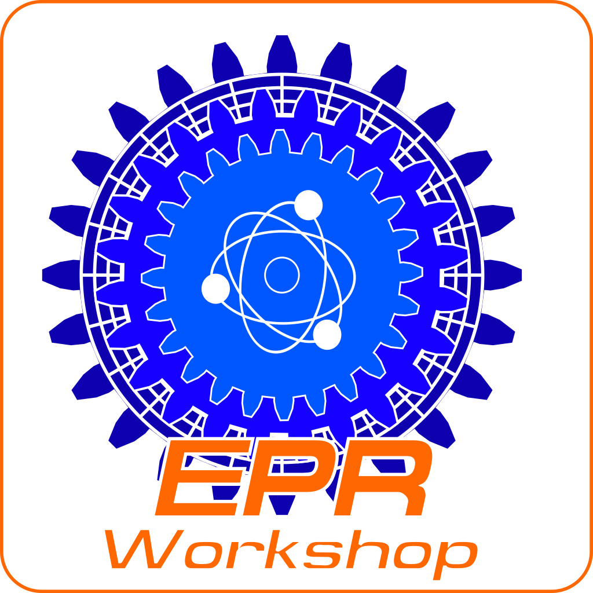

# Event Provenance Registry Workshop

Building an Event-Driven CI/CD Provenance System with Event Provenance Registry
(EPR)

## Overview

In this hands-on workshop participants will journey through the architecture of
an Event-Driven CI/CD Provenance System. We will cover microservice
architectures, asynchronous communication, data interoperability, message
specifications, and schema validation. We will learn how to leverage Golang for
service and CLI development, Docker for seamless deployment, Redpanda as a
Kafka-compatible message bus, and PostgreSQL for efficient backend storage. The
workshop uses the open-source project Event Provenance Registry (EPR) as the
central service to leverage these technologies. Over the course of the session
we will delve into the EPR codebase, work through coding and building Golang
services, discuss the theories of event driven systems, cover some pitfalls, and
examine the integration with Redpanda for effective event propagation. The
workshop provides a valuable blend of theoretical understanding and hands-on
experience in the dynamic landscape of Event-Driven CI/CD architectures.

### Workshop Overview

The workshop will guide participants through the process of building an
Event-Driven CI/CD Provenance System using Event Provenance Registry (EPR).
Participants will gain hands-on experience with Golang, Redpanda, and PostgreSQL
while working with a microservices architecture. The project, EPR, comprises
server, CLI, and client components, utilizing Cloud Events for the message
envelope and for this workshop CDEvents spec for the message payload.

## Prerequisites

While not completely necessary it will be helpful to have a basic understanding
of some core concepts we will cover in the workshop.

The prerequisites for the workshop as as follows:

- Basic understanding of Golang
- Familiarity with Docker and containerization concepts
- Knowledge of message bus systems (Kafka)
- Basic knowledge of PostgreSQL

## Requirements

Bring your own unix environment. The workshop is geared towards a Linux
development environment. While Mac OS and WSL2 work fine most of the time none
of us have tried this in native Windows without WSL2.

The requirements for the workshop are as follows:

- Laptop
- Golang installed on participants' machines
- Python installed on participants' machines
- Docker installed and running on participants' machines
- Docker Compose installed on participants' machines
- Code editor (e.g., Visual Studio Code, Sublime Text, Vim, Not Emacs)
- Command line utilities including:
  - git
  - make
  - curl
  - jq
  - go
  - golangci-lint
  - docker

## Workshop Outline

### Introduction to Event Driven Microservice Architectures

- Overview of microservice architectures for scalability and modularity
- Define an event driven asynchronous CI/CD architecture
- Explanation of EPR project and its components (server, CLI, client)
- Introduction to Cloud Events and CDEvents spec

### Setting Up the Environment

- Install Golang and set up the development environment
- Configure Redpanda (Kafka) instance
- Set up PostgreSQL database for backend storage
- Deploy PostgreSQL and Redpanda using docker-compose
- Configure environment variables for EPR

## Redpanda (Kafka): Message Queue Overview

- Overview of how to use Redpanda (Kafka) as a message bus
- Understanding the role of Redpanda (Kafka) in the event-driven architecture
- Testing message propagation and handling in with Redpanda (Kafka)

### Exploring EPR: Codebase Overview

- Get the Code
- Overview of the project structure
- Understanding the role of each component (server, CLI, client)

### Building EPR: Building Services and CLI in Golang

- Walkthrough of building the server component
- Using curl to interact with EPR
- Walkthrough of building the CLI component
- Use the CLI to interact with EPR

### Extended EPR: Creating a watcher

- Creating a watcher client using the watcher SDK
- Create a task for the Watcher
- Trigger the watcher with an event

### CDEvents EPR: Creating, Storing, and Retrieving CDEvents

- Hands-on session on utilizing EPR for CDEvents management
- Creating CDEvents for activity in the pipeline
- Storing CDEvents in EPR in Events
- Retrieving and querying CDEvents from the EPR storage
- Grouping CDEvents in EventReceivers

### Advanced EPR: Creating, Storing, and Tracking SBOMs

- Create a CycloneDX SBOM with open source tools
- Use EPR Events to store SBOMs
- Use CDEvents to record SBOM creation
- Retrieving SBOMs from EPR

### Python EPR: Working with the python client

- Hands-on session on using the EPR python client
- Creating EventReceivers using the EPR Python Client
- Creating EventReceiverGroups using the EPR Python Client
- Creating Events using the EPR Python Client
- Searching for Events using the EPR Python Client

### MCP EPR: Working with the mcp server

- Hands-on session around writing an EPR MCP server
- Write an MCP server that talks to an EPR instance
- Use Claude Desktop to interact with the MCP server
- Configure an IDE to run the MCP server
- Use MCP inspector to troubleshoot tools, resources, and prompts

### Workshop Challenge: Enhancing EPR Functionality

- Participants will be given a challenge to enhance a specific aspect of EPR
- Guidance and assistance will be provided as participants work on the challenge

### Q&A and Discussion

- Participants can ask questions and engage in discussions
- Sharing experiences and insights from the workshop

### Conclusion and Next Steps

- Recap of key learnings
- Encouragement to explore further and contribute to the EPR project
- Providing additional resources for continuous learning

Note: Detailed instructions, code snippets, and configurations will be provided
during the workshop for participants to follow along. The goal is to ensure that
participants gain practical experience in building an Event-Driven CI/CD
Provenance System using EPR and Golang, specifically focusing on creating,
storing, and retrieving CDEvents.
